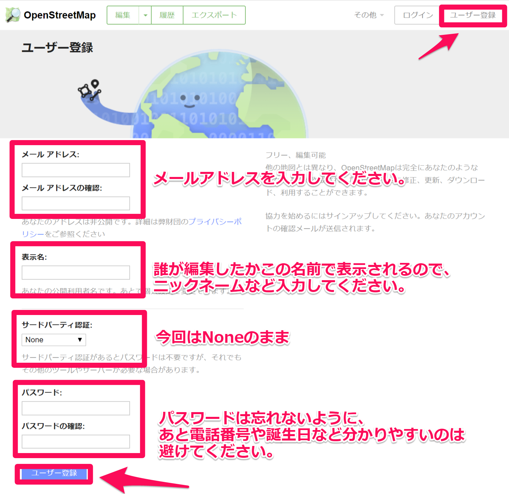
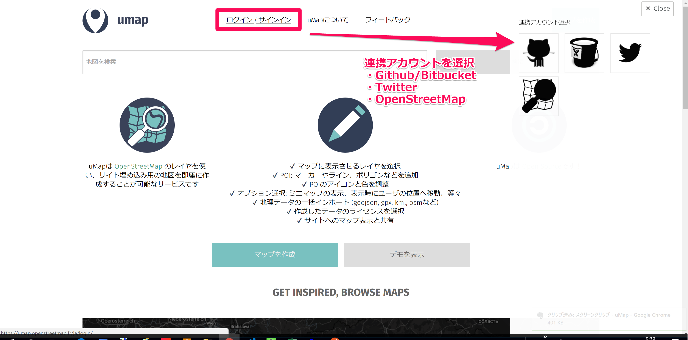
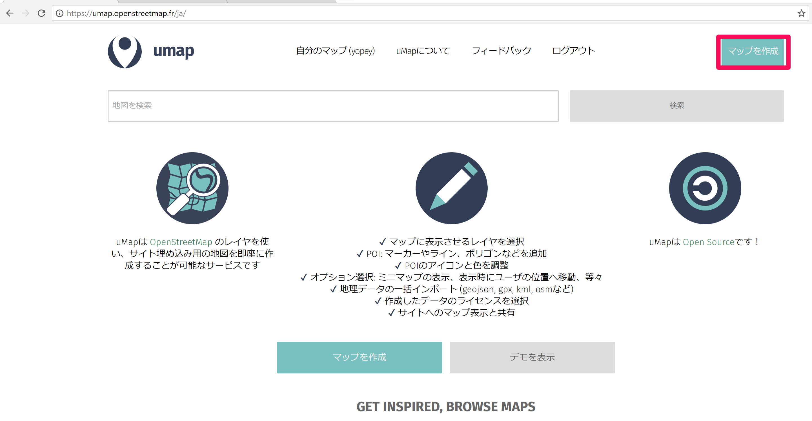
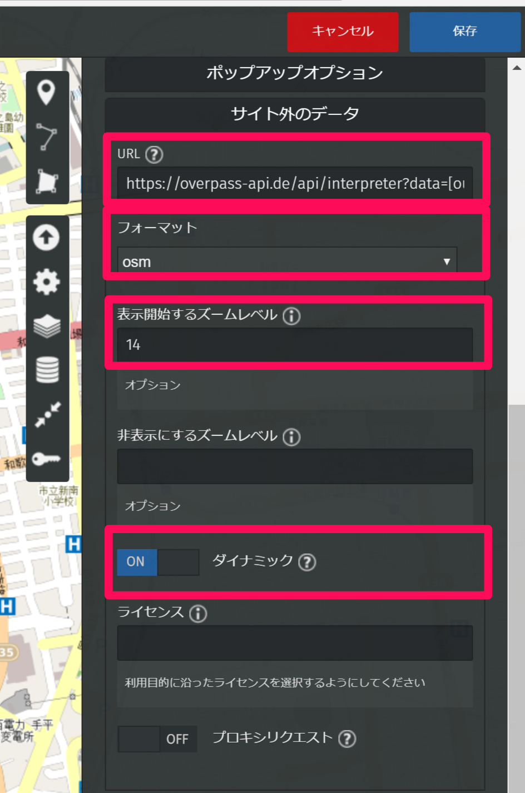
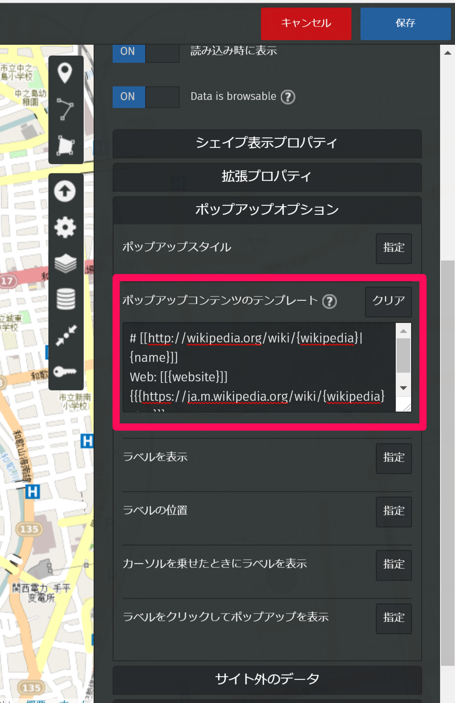
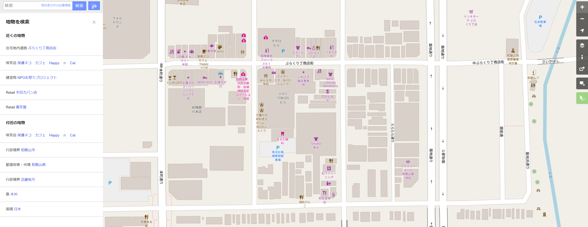

  <small>
  Wacker #24　2018/03/18(日)  
  </small>

 

### 自分のサイトに貼る地図を上手く作る方法

 

 Yohei Taniguchi 

  <small>

    [Wacker](http://wacker.io/)

  </small>

  

---

## 今日やる事

- uMapを使って自分の地図を作る。
- Overpass APIを使ってOpenStreetMapからデータを抽出する。
- 自分のサイトにデータを追加する。

---

## 仕込み

- (必要なら)Githubアカウントの作成
- OpenStreetMapのアカウント作成
- uMapアカウントの作成
- サンプルサイトのテンプレートダウンロード

--

### OpenStreetMapのアカウント作成

[OpenStreetMap](https://www.openstreetmap.org/):https://osm.org

--

### uMapアカウントの作成

[uMap](https://umap.openstreetmap.fr/ja/):https://umap.openstreetmap.fr/ja/

---

## 今日の成果イメージ

<iframe width="100%" height="500px" frameBorder="0" src="https://umap.openstreetmap.fr/ja/map/wacker-24_206109?scaleControl=false&miniMap=false&scrollWheelZoom=false&zoomControl=true&allowEdit=false&moreControl=true&searchControl=null&tilelayersControl=null&embedControl=null&datalayersControl=true&onLoadPanel=undefined&captionBar=false"></iframe>
<a href="https://umap.openstreetmap.fr/ja/map/wacker-24_206109">フルスクリーン表示</a>

---

### サンプルサイトのテンプレートダウンロード

- 以下のURLからダウンロード
[https://github.com/yoheitaniguchi/myMapSite](https://github.com/yoheitaniguchi/myMapSite)

- ＊自分のサイトを持っている方は不要です。

---

## uMap：マップ作成

--

## uMap：マップ設定画面

--

## uMap：レイヤー設定画面

---

## 日赤 献血バスの日程からの地図をつくる

--

### CSVをダウンロード

- 日本赤十字社和歌山県赤十字血液センター 献血バスの日程の一覧
    http://www.wakayama.bc.jrc.or.jp/bus/license/

--

### Googleスプレッドにコピーして編集する

- CSVファイルの内容をコピー
- 緯度・経度の列を先頭に持ってきて、それぞれ「lat」「lon」に変更
- 場所名称を「name」に変更

--

### Googleスプレッドをウェブに公開

- ファイル　→　ウェブに公開
- URLをコピーする

--

### uMapへインポート

- 右のメニューからインポートを選択（Ctr + i）
- URLを貼り付ける
- インポートデータ形式を選択「csv」
- インポート対象レイヤ選択：任意のレイヤー、もしくは「新規レイヤーをインポート」
- インポートを実行

---

## Overpass APIを使ってOpenStreetMapからデータを抽出する。

--

### uMap:layer設定：サイト外のデータ

--

### uMap:layer設定：サイト外のデータ

設定内容
- URL:https://overpass-api.de/api/interpreter?data=[out:json][timeout:2000];(node["railway"="station"]({south},{west},{north},{east});way["railway"="station"]({south},{west},{north},{east}););out body center qt;>;out skel qt;

- フォーマット:osm
- 表示開始するズームレベル：14

--

## uMap:layer設定：ポップアップオプション

--

## uMap:layer設定：ポップアップオプション

設定内容
- ポップアップコンテンツのテンプレート：# [[http://wikipedia.org/wiki/{wikipedia}|{name}]]
Web: [[{website}]]
{{{https://ja.m.wikipedia.org/wiki/{wikipedia}%20}}}

--

### Overpass APIのクエリー作成

データ抽出クエリを作成＆検証が出来るサイト
<iframe width="100%" height="500px" frameBorder="0" src="http://overpass-turbo.eu/s/x6o"></iframe>
<a href="http://overpass-turbo.eu/">overpass-turbo</a>

--

### Overpass APIのクエリー作成

- 画面上部の「ウイザード」
- 検索ボックスにOpenStreetMapのタグを入力
- 例：
  - 駅：railway=station
  - 公園：leisure
  - 病院：amenity=hospital
  - コンビニエンスストア=shop=convenience
  - カフェ＝amenity=cafe

--

### OpenStreetMap:タグの調べ方

- [OpenStreetMapのサイト](https://www.openstreetmap.org/)を開く
- 右下のメニュー「地図」を検索をクリック
- 調べたいを場所をクリック
- 左に表示される情報から調べたい項目をクリック
- 表示される詳細に記されたタグを調べる

---

---

## 自分のサイトにデータを追加する。

- uMapを開く
- 左メニューの「サイトマップの埋込と共有」を押下
- 表示される「マップ埋め込み」のURLをコピー
- 自分のサイトにペーストして表示を確認

--

## 今日の成果

https://yoheitaniguchi.github.io/myMapSite/

---
